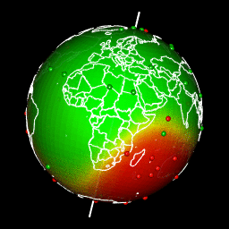
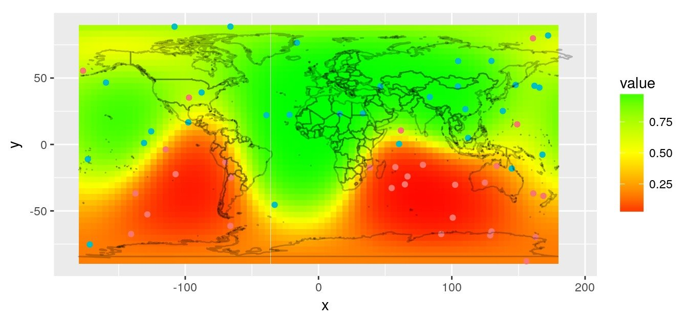
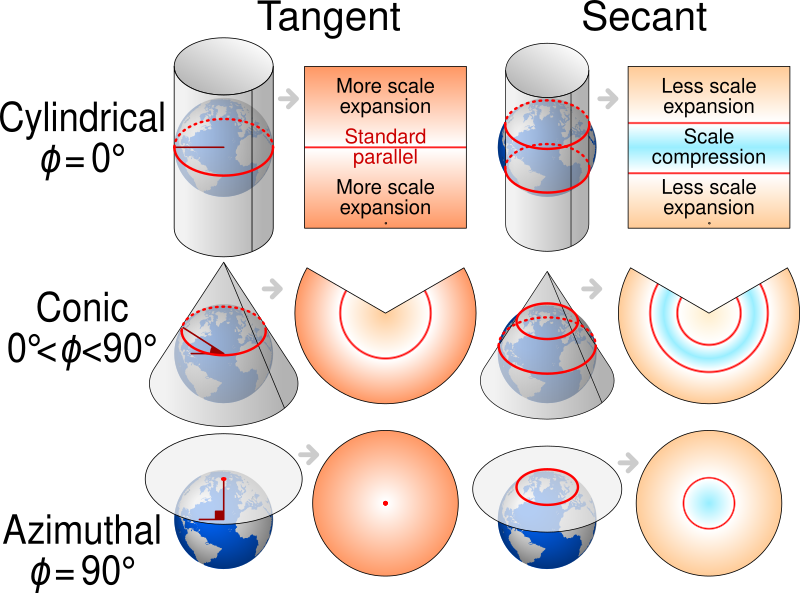
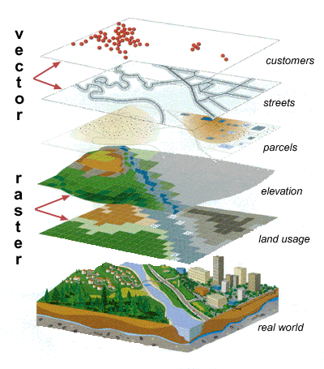
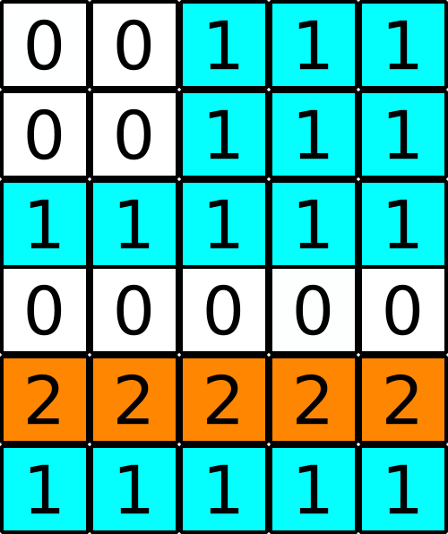
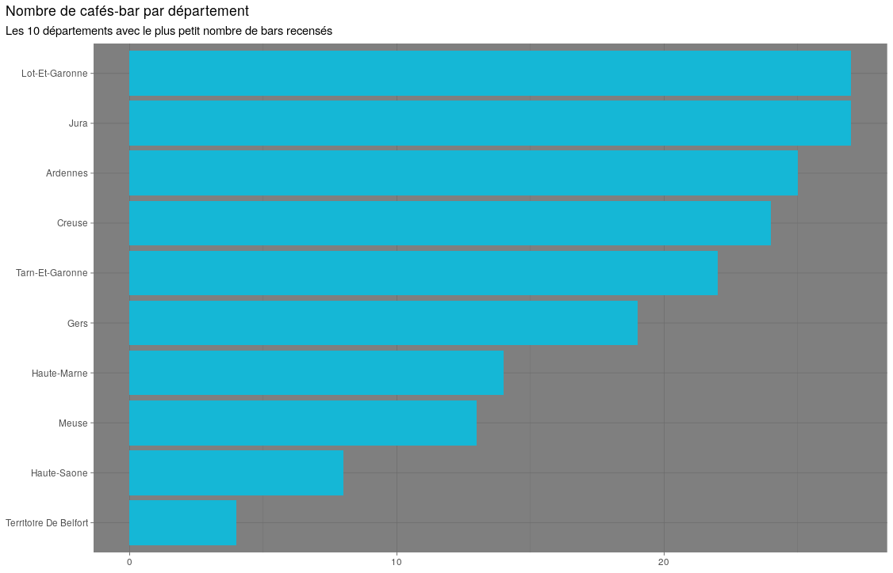
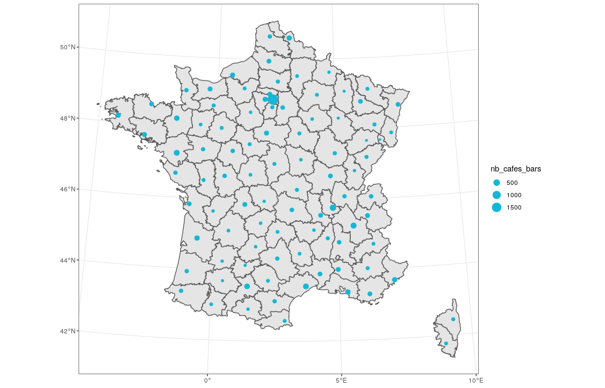

```{r include=FALSE}
knitr::opts_chunk$set(
  cache = FALSE,
  message = FALSE,
  warning = FALSE,
  eval = TRUE,
  fig.align = "center", fig.height = 5, comment ="")
```

```{r, include=FALSE}
library(sf)
library(tmap)
library(here)
library(tidyverse)
```

# First steps in spatial data handling and visualization with {dplyr} and {tmap}

## Contents of this workshop is based on the workshop conducted by Sébastien Rochette, Dorris Scott, Jakub Nowosad at useR2020!
## @statnmap, @Dorris_Scott, @jakub_nowosad

### The original material of this course is on [Github](https://github.com/statnmap/user2020_rspatial_tutorial).

### You can access the materials for today's workshop [here](https://rstudio.cloud/project/1563161).

---

# Workshop overview

- Basis of Cartography

- Spatial vectors data: read & project

- Drawing maps with R

- Manipulating vector data with dplyr

- Second steps in spatial data handling

---

# Workshop overview

- There will be three exercises to complete.

- People will be assigned to breakout rooms. I will go from one breakout room to another to help people with any issues they have.

- You will have 15 minutes to complete the exercises.


---

class: center, middle, inverse


# Basis of Cartography

## The Earth is not flat...

---

### What is a map ?

A Two-dimensional representation of all or part of our planet  


.pull-left[
```{r, echo=FALSE, fig.cap= "3D globe."}

```
]
.pull-right[
```{r, echo=FALSE, fig.cap = "map showing a range in values."}

```

_Sorry no..._
```{r, echo=FALSE, out.width="70%", fig.cap= "A flat earth."}

```

]

---

### What is a projection?

The source of most of your problems in cartography...

<!-- - In 2D, maps are always represented using a projected reference system -->

```{r, echo=FALSE, out.width="60%", fig.cap= "Types of map projections."}

```

> By cmglee, US government, Clindberg, Palosirkka - Globe Atlantic.svg, CC BY-SA 4.0, https://commons.wikimedia.org/w/index.php?curid=84845850

---


### What is a projection?

- In R, you will talk about `CRS` (Coordinates Reference System)
- You need to know the projection of your datasets

> Use the name of the CRS in the name of your spatial object!
This will prevent you from making many mistakes...

```{r, echo=TRUE, eval=FALSE}
france_l93
france_wgs84
world_wintri
world_eck
```

---
class: slide

### Earth is moving...

- ...Coordinate reference systems is moving too
  + WKT (Well-Known Text)
  + Plate tectonics
  
```{r, echo=FALSE, out.width="70%", fig.cap= "Coordinate Reference System description."}
knitr::include_graphics("images/wkt_sf.png")
```

> J. Nowosad, R. Lovelace. https://nowosad.github.io/whyr_webinar004/

---

### Geographic objects (entities)


```{r, echo=FALSE, out.width="40%", fig.cap= "Types of vector and raster data."}

```

[Image Source](https://www.passaiccountynj.org/government/departments/planning_and_economic_development/gis_services.php)

---

### Vector objects

Geographic objects (entities):

- Points: entities without surface and which cannot be represented by lines

- Lines (arcs) :
    + Objects too narrow to be described by a surface (street, river -depending on the scale of representation-)
    + Objects with a length but no surface (coastline, departmental boundaries...)
    
- Polygons: Homogeneous surface objects (island, building,...)

Storage is done in a single database or in several files  
> One layer = one type of entity

---


### Raster objects (rasters)

The storage is done in the form of a rectangular matrix of values

.pull-left[
- Decomposition of regular meshes into grids

- Each mesh (=pixel) has a specific value related to its representation attribute (quality)

- A raster is defined by:
    + Its geographical extension
        + Number of rows, columns and geographical position (corner)
        
    + Its spatial resolution
        + Mesh size + Mesh size  
]
.pull-right[
```{r, echo=FALSE, fig.cap= "Raster data representation."}

```
]  

---

### Packages for reading geographic data in R

- Past: {sp} + {rgdal} + {rgeos} + {raster}
- Current packages:
  + {sf} : reading and manipulation of vector type data
      + {tidyverse} style
  + {stars} : reading and manipulation of space-time raster data
      + {tidyverse} style
  + {terra} : reading, manipulation and processing of rasters
      + Improved version of {raster}

---
class: slide

### Quiz: What is the **first** question to ask yourself when you have a problem with your spatial data manipulations?


+ A: Did I reboot my computer?   

+ B: What is the projection?  

+ C: What is the format of my spatial data?   

+ D: Who taught me this stuff? Doris? Dorris? Whatever her name is. 


---

### Summary

- Projections: The main problem to deal with in cartography,

- Projections: Different depending on spatial extent of datasets,  

- Vector data: Points coordinates with attributes table
  + Lines: points ordered and linked by a line,
  + Polygons: points ordered and linked by a line that closes on itself.

- Rasters data: regular grid of data.

---


class: center, middle, inverse


# Spatial vectors data: read & project

## Everything is fine with {sf}

---

### {sf} : Read geographical datasets

Read with `read_sf()`:

- All formats handled by GDAL (http://www.gdal.org/)
    + CSV, Mapinfo, Google Earth, GeoJSON, PostGIS, ...
- ESRI shapefile
    + Among most used
    + Minimum of **four** files (shp, shx, dbf, prj)
- GeoPackage
    + New format standard
    + To be preferred

```{r, echo=FALSE}
# dataWD <- "data"
departements_l93 <- read_sf(
  dsn = here::here("data/departements"),
  layer = "departement",
  quiet = TRUE)
study_area_l93 <- read_sf(here::here("data/departements/area_l93.gpkg"))
```
```{r, echo=TRUE, eval=FALSE}
# Map of France departments
departements_l93 <- read_sf("data/departements/departement.shp")
# Limits of a study area
study_area_l93 <- read_sf("data/departements/area_l93.gpkg")
```

---

### Projections

- Get coordinates reference system: `st_crs()`

```{r}
st_crs(departements_l93)
```

---

### Projections

- Project layer into new coordinates reference system: `st_transform()`

```{r}
# Transform into geographic coordinates system
departements_wgs84 <- departements_l93 %>%  
  st_transform(crs = 4326) # EPSG = 4326

st_crs(departements_wgs84)
```

---

### Read text file with coordinates

- Read a csv, txt, xls, ... with the adapted package 
    + {readr}, {readxl}, ...

```{r,  eval=FALSE}
cafes_bars <- read_csv("data/cafes_bars.csv")
cafes_bars
```
```{r, fig.cap= "list of cafes and bars in France", echo=FALSE, message=FALSE}
# Teacher - Read data
cafes_bars <- read_csv(here::here("data/cafes_bars.csv"))
cafes_bars
```

---

### Read text file with coordinates

- Use `st_as_sf()` to transform into spatial dataset

```{r, fig.cap= "Map of France projected in WGS84."}
cafes_bars_wgs84 <- cafes_bars %>% 
  st_as_sf(coords = c("lng", "lat"), crs = 4326)
```

```{r, echo=FALSE, out.width="52%"}
ggplot() +
  geom_sf(data = departements_l93) +
  geom_sf(data = cafes_bars_wgs84, 
          size = 0.5,
          colour = "grey20",
          alpha = 0.3)
```

---

### Write spatial dataset on disk

Write with `write_sf()` :

- All formats handled by GDAL (http://www.gdal.org/)
    + CSV, Mapinfo, Google Earth, GeoJSON, PostGIS, Shp, ...
- GPKG format (GeoPackage)
    + New standard of OGC
    + Recommended

```{r, eval=FALSE}
write_sf(point_wgs84, "new-directory/point_wgs84.gpkg")
```

---
class: slide, no-margin

### Quiz: What is the correct way to deal with the following text file with coordinates to be used as a spatial points dataset?

- Let `"data_coords.txt"` be a text file at the root of your project
- Position of points was taken using a GPS in France
- Note: `2154`: Lambert 93, France, projected; `4326`: Geographical coordinates 
```{r, echo=FALSE}
data.frame(
  lat = c(48.5, 49, 47),
  lng = c(2, 2.5, 3),
  sample = c("A", "B", "C")
)
```

.pull-left[
+ A
```{r, eval=FALSE}
d_text <- read_txt("data_coords.txt")
pts_wgs84 <- d_text %>% 
      st_as_sf(coords = c("lng", "lat"),
               crs = 4326)
```
+ B
```{r, eval=FALSE}
d_text <- read_txt("data_coords.txt")
pts_wgs84 <- d_text %>% 
      st_transform(crs = 4326)
```
]
.pull-right[
+ C 
```{r, eval=FALSE}
d_text <- read_txt("data_coords.txt")
pts_l93 <- d_text %>% 
      st_as_sf(coords = c("lat", "lng"),
               crs = 2154)
```
+ D
```{r, eval=FALSE}
pts_wgs84 <- read_sf("data_coords.txt")
```
]

???

A: Correct answer

B: `st_transform()` applies to data that are already spatial datasets. Here we have a classical text file, a classical dataframe.

C: `st_as_sf()` specifies the crs of the data inside the dataset. Not a targeted crs. If you want to change the crs, then use `st_transform()` afterwards

D: You cannot read the text file with `read_sf()` as is. This is not already a spatial dataset, even if there are some columns somewhere inside with spatial coordinates.

---

### Summary

- Package : {sf}
- Read : `read_sf()`
- Write : `write_sf()`
- Get projection : `st_crs()`
- Transform, Project : `st_transform()`
- Text file into spatial : `st_as_sf()`


---

### Activity

- Do `Exercises: Spatial vectors data: read & project`. 

- Fifteen minutes will be allotted for this exercise.

- Stop once you reach `Exercises: Drawing maps with R`.


---


class: middle, inverse, center

# Drawing maps with R

## "{tmap} and vectors"

---

### Drawing spatial data

- Packages not directly dedicated for making maps
  + static : {r-base}, {ggplot2}, {rgl}
  + interactive : {plotly}  


- Packages dedicated for making maps
  + static : {tmap}, {ggspatial}, {cartography}
  + interactive : {mapview}, {leaflet}, {mapdeck}


---
class: slide

### Do you really want to draw a map?

- What is your question?
- What message do you want to communicate?
- Can the map deliver this message in 3 seconds?
- **Only use maps if the spatial distribution (pattern) is meaningful**

.pull-left[
```{r, echo=FALSE, fig.cap = "Bar chart on the number of cafes per department in France."}

```
]
.pull-right[
```{r, echo=FALSE, fig.cap = "Map of the number of cafes in France represented by point size."}

```
]
_What is the department with the smallest number of cafés-bars in France?_

---
class: slide

### Visualisation rules

```{r, echo=FALSE, out.width="85%", fig.cap= "Visualization rules."}
knitr::include_graphics("images/cartographie-choose-representation.png")
```

*https://comeetie.github.io/satRday/lecture/lecture.html#maps-with-r*

> If you point a to particular place in a polygon, does its representation correspond to what is happening at that particular place? (e.g. forest, number of inhabitants, density)

---
class: slide

### Read some spatial data

- `read_sf()` from `{sf}` can read shapefiles (`.shp`) and many more file spatial vector formats

```{r, eval=FALSE, echo=FALSE}
# Prepare Europe dataset
data("World", package = "tmap")
europe <- World %>% 
  filter(continent == "Europe" &
           name != "France") 
write_sf(europe, here::here("data/europe/europe.gpkg"), delete_layer = TRUE, quiet = TRUE)
```

```{r, echo=FALSE, message=FALSE}
# For teacher - invisible
# vector
departements_l93 <- read_sf(
  dsn = here("data/departements"),
  layer = "departement",
  quiet = TRUE)
# Points
cafes_bars_l93 <- read_sf(here("data/cafes_bars/cafes_bars.shp"), quiet = TRUE)
# Europe
europe <- read_sf(here("data/europe/europe.gpkg"), quiet = TRUE)
```

```{r, echo=TRUE, eval=FALSE}
library(sf)
# Read included dataset
# Use the tabulation for auto-completion of path
europe <- read_sf("data/europe/europe.gpkg")
departements_l93 <- read_sf("data/departements/departement.shp")
cafes_bars_l93 <- read_sf("data/cafes_bars/cafes_bars.shp")

getwd()
```


???

There are other packages and other formats, but we do not speak about them right now.

---

### {tmap} for thematic maps

- Which dataset do you want to map?
  + `tm_shape()`
- How do you want it to be represented?
  + `tm_symbols()` : points
  + `tm_lines()` : lines
  + `tm_polygons()`, `tm_fill()`, `tm_borders()` : polygons
  + `tm_text()` : text


---

### {tmap} for thematic maps

- Which dataset do you want to map?
  + `tm_shape()`
- How do you want it to be represented?
  + `tm_symbols()` : points
  + `tm_lines()` : lines
  + `tm_polygons()`, `tm_fill()`, `tm_borders()` : polygons
  + `tm_text()` : text

.pull-left[
```{r carto-tmap2, echo=TRUE, warning=FALSE, eval=FALSE}
tm_shape(europe) +
  tm_polygons() +
tm_shape(departements_l93,
         is.master = TRUE) +
  tm_fill(col = "NOM_DEPT",
          palette = "Set1")
```
]
.pull-right[
```{r carto-tmap-out2, ref.label="carto-tmap2", echo=FALSE, out.width="90%", fig.cap= "Map of the various departments of France."}
```
]

---
class: slide

### {tmap} for thematic maps

- Which dataset do you want to map?
  + `tm_shape()`
- How do you want it to be represented?
  + `tm_symbols()` : points
  + `tm_lines()` : lines
  + `tm_polygons()`, `tm_fill()`, `tm_borders()` : polygons
  + `tm_text()` : text

.pull-left[
```{r carto-tmap3, echo=TRUE, warning=FALSE, eval=FALSE, fig.cap= "Map of the various departments of France with bolder borders."}
tm_shape(europe) +
  tm_polygons() +
tm_shape(departements_l93,
         is.master = TRUE) +
  tm_fill(col = "NOM_DEPT",
          palette = "Set1",
          legend.show = FALSE) +
  tm_borders("grey30")
```
]
.pull-right[
```{r carto-tmap-out3, ref.label="carto-tmap3", echo=FALSE, out.width="90%"}
```
]

---
class: inverse, middle, center

### {tmap} for thematic maps

---

- Add position information
  - `tm_scale_bar()`, `tm_compass()`
- What is the general appearance of the graph?
  - `tm_layout()`


.pull-left[
```{r carto-tmap-layout, echo=TRUE, warning=FALSE, eval=FALSE}
tm_shape(europe) +
  tm_polygons() +
tm_shape(departements_l93,
         is.master = TRUE) +
  tm_fill(col = "NOM_DEPT",
          legend.show = FALSE,
          palette = "Set1") +
  tm_borders("grey30") +
tm_scale_bar() +
tm_compass(position = c("right", "top")) + 
tm_layout(title = "French departments")
```
]
.pull-right[
```{r carto-tmap-out4, ref.label="carto-tmap-layout", echo=FALSE, out.width="90%", fig.cap= "Map of French departments which include a scale bar, north arrow, and title."}
```
]
  
---
class: slide

### Quiz: What is the correct code to draw `departements_l93` map?

- `departements_l93` is a spatial object of polygons

.pull-left[
+ A
```{r, eval=FALSE}
tm_shape(departements_l93) + 
    tm_symbols(col = "red") +
    tm_layout(title = "France")
```
+ B
```{r, eval=FALSE}
tm_polygons(departements_l93) + 
    tm_layout(title = "France")
```
]
.pull-right[
+ C 
```{r, eval=FALSE}
tm_shape(departements_l93) + 
    tm_polygons() +
    tm_layout(title = "France")
```
+ D
```{r, eval=FALSE}
tm_shape(departements_l93) +
    tm_polygons() +
    labs(title = "France")
```
]

???

A: `tm_symbols()` is for point datasets
B: You need to call data with `tm_shape()`
C: Correct
D: `labs()` is a function from {ggplot2}

  
---
class: slide

### Summary

- Do you really need a map?  

- Choose the correct spatial representation  

- Read a shapefile with {sf}: `read_sf()`  

- Draw with {tmap}:
  - `tm_shape()`: Layer to draw
  - `tm_symbols()`/`tm_lines()`/`tm_polygons()`/`tm_text()`: How to draw
  - `tm_scale_bar()`, `tm_compass()`: position information
  - `tm_layout()`: general appearance
  
---


### Activity

- Do `Exercises: Drawing maps with R`. 

- FIfteen minutes will be allotted for this exercise.

- Stop once you reach `Exercises: Manipulating vector data with dplyr`.


---

class: inverse, middle, center

# Manipulating vector data with dplyr


---

### Vector data format

- With {sf}, data are rectangular

```{r, include=FALSE, fig.cap= "description of departments in rectangular form." }
# Teacher
departements_l93 <- read_sf(
  dsn = here::here("data/departements"),
  layer = "departement",
  quiet = TRUE)
```
```{r, echo=TRUE, eval=FALSE}
library(sf)
# Read example data
# vector
departements_l93 <- read_sf("data/departements/departement.shp")
# Text file - number of inhabitants
dept_inhabitants <- read_csv("data/departements/repartition_dpt_clean_2015.csv")
```
```{r}
departements_l93
```

---
class: slide, no-margin

### Operations on rows and columns

All that you know with {dplyr} works on {sf} objects
+ `%>%`
+ `select`, `mutate` for attributs (= columns)
+ `filter`, `arrange` for entities (= rows)

```{r, echo=TRUE, fig.cap= "A map of departments in the Bretagne region."}
bretagne_l93 <- 
  departements_l93 %>% 
  mutate(NOM_DEPT = str_to_title(NOM_DEPT)) %>% 
  select(CODE_DEPT, NOM_DEPT, NOM_REG) %>% 
  filter(NOM_REG == "BRETAGNE")
```

```{r, fig.width=9, fig.height=5, echo=FALSE, out.width="55%", fig.cap = "Bretagne region of France."}
ggplot(bretagne_l93) +
  geom_sf(aes(fill = NOM_DEPT)) +
  scale_fill_viridis_d() +
  theme_bw()
```

---
class: slide, no-margin

### Grouped operations

- Merge entities with `group_by` + `summarize`

```{r, echo=TRUE}
region_l93 <- departements_l93 %>% 
  group_by(NOM_REG) %>% 
  summarize()
```

.pull-left[
```{r, echo=FALSE, fig.cap= "Map of all of the departments of France."}
ggplot(departements_l93) +
  aes(fill = NOM_REG) +
  scale_fill_viridis_d() +
  geom_sf() +
  coord_sf(crs = 2154, datum = 4326) +
  guides(fill = FALSE) +
  theme(title = element_text(size = 16)) +
  labs(title = "Departments")
```
]
.pull-right[
```{r, echo=FALSE, fig.cap= "The second map shows the regions of France which was created by a group_by and summarize dplyr verbs."}
ggplot(region_l93) +
  aes(fill = NOM_REG) +
  scale_fill_viridis_d() +
  geom_sf() +
  coord_sf(crs = 2154, datum = 4326) +
  guides(fill = FALSE) +
  labs(title = "Regions") +
  theme(title = element_text(size = 16))
```
]

---
class: slide, no-margin

### Join with classical datasets

- Between shapefile and dataset with `*_join`
  + `left_join()`, `inner_join()`, `full_join()`, ...
  + Read external classical dataset
```{r, echo=FALSE, eval=TRUE}
# Text file - number of inhabitants
dept_inhabitants <- read_csv(here::here("data/departements/repartition_dpt_clean_2015.csv"))
```
```{r, echo=TRUE, eval=FALSE}
# Text file - number of inhabitants
dept_inhabitants <- read_csv("data/departements/repartition_dpt_clean_2015.csv")
```
  + Content of shapefile: `departements_l93`
```{r}
departements_l93
```

---
class: slide, no-margin

### Join with classical datasets

- Between shapefile and dataset with `*_join`

.pull-left[
- Department shapefile `departements_l93`  

```{r}
# Shapefile of the departments.
glimpse(departements_l93, width = 30)
```
]
.pull-right[
- Number of inhabitants by age by department in `dept_inhabitants`

```{r, message = FALSE}
# CSV with information about inhabitants in each department
glimpse(dept_inhabitants, width = 30)
```
]

---
class: slide, no-margin

### Join with classical datasets

```{r, fig.cap= "Joining the csv file to the shapefile by keys"}
# Join database with shapefile by attributes
departements_inhabitants_l93 <- departements_l93 %>%
 inner_join(dept_inhabitants, by = c("CODE_DEPT" = "ID_DPT"))

glimpse(departements_inhabitants_l93, width = 40)
```


???

---
class: slide

### Quiz: What code do you choose to join the external classical dataset `restaurants` with the spatial dataset `france_l93` if you want to keep spatial entities but only where there is a match?

.pull-left[
*restaurants*
```{r, echo=FALSE}
data.frame(
  department = c("CALVADOS", "ALPES-MARITIMES", "CANTAL"),
  restaurants = c(1500, 3000, 2000)
)
```

+ A
```{r, eval=FALSE}
france_l93 %>% 
  group_by(restaurants)
```
+ B
```{r, eval=FALSE}
france_l93 %>% 
  left_join(restaurants)
```
+ C 
```{r, eval=FALSE}
restaurants %>% 
  inner_join(france_l93)
```
]
.pull-right[
*france_l93 (extract)*
```{r, echo=FALSE}
departements_l93 %>% 
  rename(department = NOM_DEPT) %>% 
  select(department, geometry) %>% 
  as_tibble() %>%
  print(n = 2, width = 40)
```

+ D
```{r, eval=FALSE}
france_l93 %>% 
  inner_join(restaurants)
```
]

???
A: `group_by()` has no direct effect on datasets. Moreover, it is used with a single dataset on itself to realise grouped operations on modalities of one (or more) variables

B: `left_join()` will keep all spatial entities of the original spatial dataset and add `NA` where there is no match. This does not anwser the question to keep them only where there is a match.

C: If you want to keep spatial entities, spatial dataset needs to be the first object, otherwise `inner_join()` will be applied as usual with classical datasets

D: Correct answer

---

### Summary

- {dplyr} grammar on attribute table
  + `select()`, `mutate()`, `filter()`, ...
  + `inner_join()`, `left_join()`, `full_join()`, `anti_join()`, ...  
  
- {dplyr} grammar on attribute + geometry
  + `group_by()` + `summarise()`

- Note that there is also compatibility with {tidyr} functions

---

### Activity

- Do `Exercises: Manipulating vector data with dplyr`. 

- Fifteen minutes will be allotted for this exercise.


---

class: inverse, middle, center

# Second steps in spatial data handling


---

# Wait there's more! 

--

## There are a variety of spatial functions that you can use to manipulate your data

--

- `st_crs()` : coordinates reference system
- `st_bbox()` : spatial extent
- `st_join()` : spatial left join
- `st_intersection()` : intersection join
- `st_crop()` : crop
- `st_union()` : union
- `st_difference()` : difference
- `st_area()` : area
- `st_distance()` : distance
- `st_length()` : length
- `st_centroid()` : find centroid
- `st_buffer()` : buffer area

---

## To learn more about these functions, please refer to the original [useR2020! workshop](https://github.com/statnmap/user2020_rspatial_tutorial)


---

class: inverse, middle, center

## Thank you!


